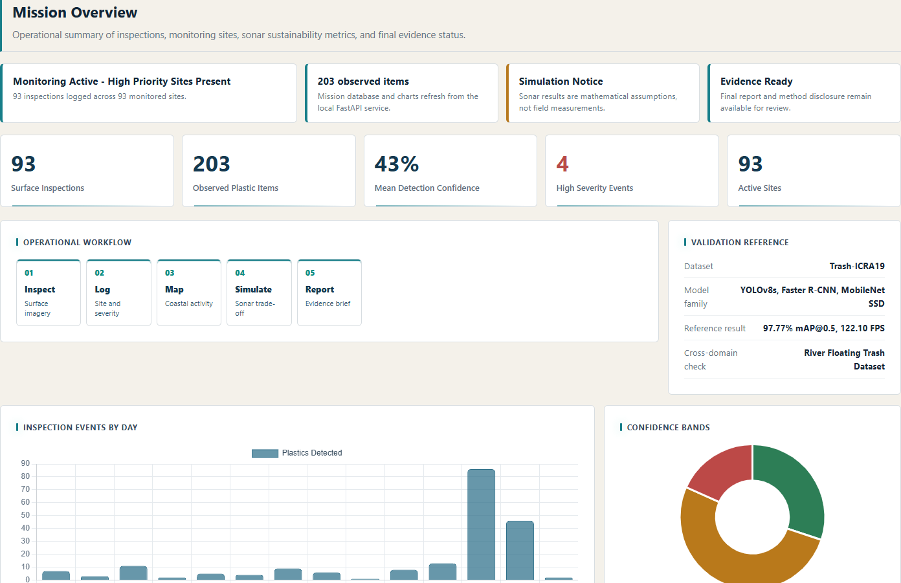
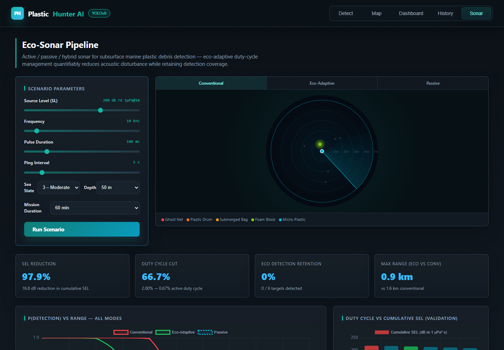
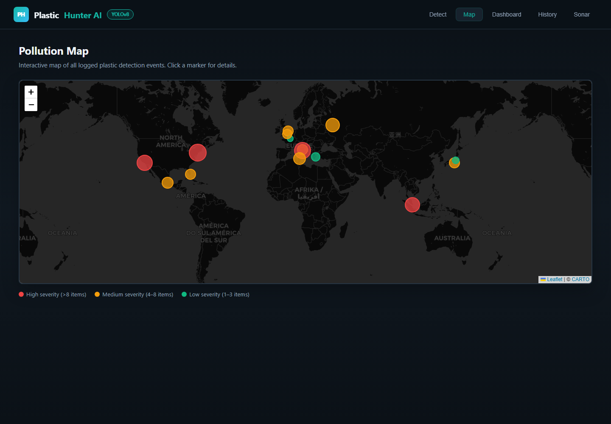
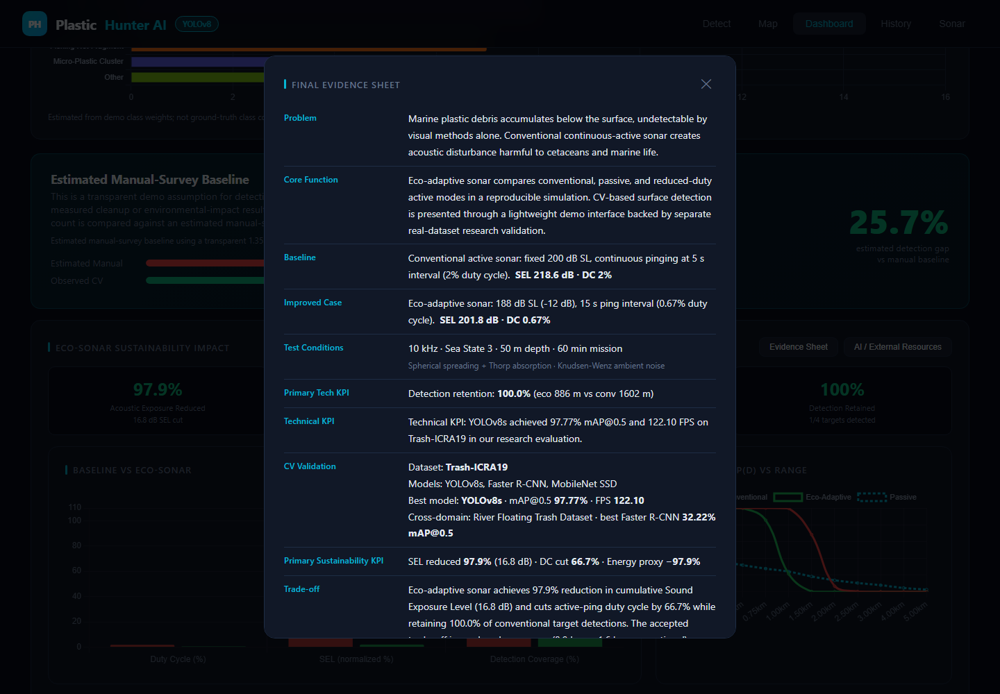
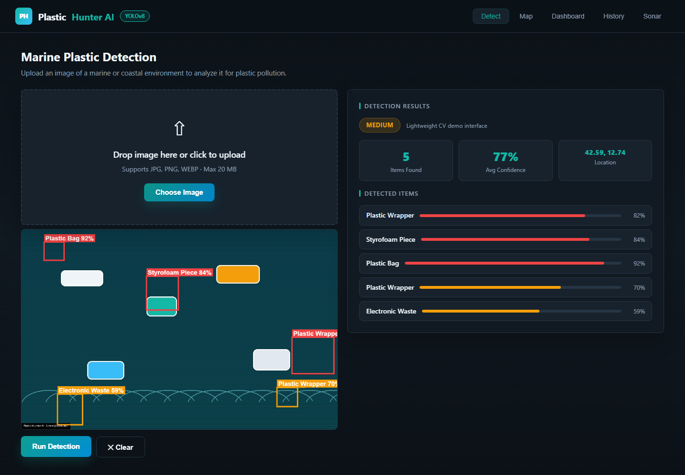
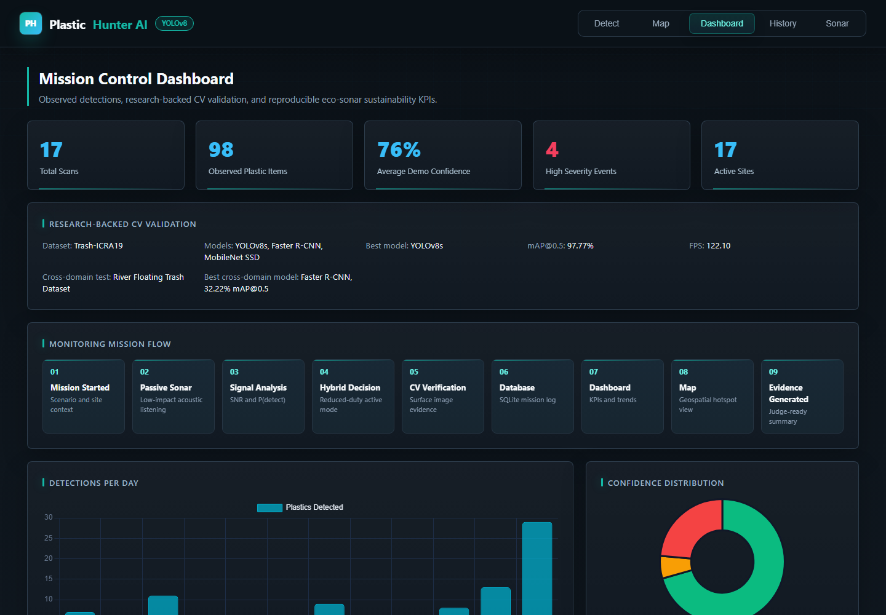
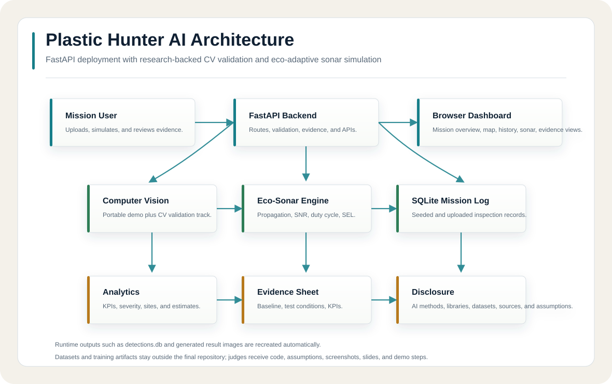

# Plastic Hunter AI

**Plastic Hunter AI is an integrated marine monitoring platform combining computer vision and eco-adaptive sonar simulation for sustainable marine debris detection.**

> **Research Foundation**  
> This project is supported by our research on deep learning-based marine debris detection using the Trash-ICRA19 benchmark and cross-domain evaluation on the River Floating Trash Dataset.

Team EcoNauts  
IEEE AESS Sustainability Hackathon 2026 Finalist

## Overview

Plastic Hunter AI provides a deployment-ready FastAPI application with a browser dashboard for marine debris monitoring. The platform combines image-based surface detection, SQLite-backed mission logging, geospatial visualization, eco-sonar trade-off simulation, analytics, and a judge-ready evidence sheet.

The live demonstration uses a lightweight deployment configuration optimized for rapid execution while preserving the research-backed detection workflow.

## Screenshots

### Hero Screenshot



### Dashboard


### Sonar



### Map



### Evidence Sheet



### Detection



### Mission Flow



## Architecture



```text
User
↓
FastAPI API
↓
Computer Vision
↓
Sonar Engine
↓
SQLite
↓
Analytics
↓
Dashboard
```

## Project Structure

```text
plastic-hunter-final/
├── main.py                         # FastAPI app, API routes, evidence and disclosure endpoints
├── detector.py                     # Lightweight deployable CV demo interface
├── sonar.py                        # Eco-adaptive sonar simulation engine
├── database.py                     # SQLite persistence, seeded demo records, analytics
├── static/
│   ├── index.html                  # Browser dashboard
│   └── favicon.ico
├── docs/
│   └── assets/
│       ├── architecture.svg
│       └── screenshots/
├── requirements.txt
├── Dockerfile
├── .dockerignore
└── SUBMISSION_CONCEPT_DOCUMENT.md
```

Runtime files:

- `results/` stores annotated upload images generated during use.
- `detections.db` is created automatically and seeded by `database.py`.

## Research Foundation

The computer vision component is based on an internal research study conducted by the team using real marine debris datasets, including Trash-ICRA19 and the River Floating Trash Dataset.

The study evaluated YOLOv8s, Faster R-CNN, and MobileNet SSD. YOLOv8s achieved 97.77% mAP@0.5 at 122.10 FPS on Trash-ICRA19.

The paper is currently under preparation / submission and is not yet publicly published.

### Models

- YOLOv8s
- Faster R-CNN
- MobileNet SSD

### Results

| Dataset | Best Model | Metric |
|---|---:|---:|
| Trash-ICRA19 | YOLOv8s | 97.77% mAP@0.5, 122.10 FPS |
| River Floating Trash Dataset | Faster R-CNN | 32.22% mAP@0.5 |

### Deployment in Plastic Hunter AI

The deployed demo uses a lightweight image-analysis interface for fast execution in constrained environments. The evidence sheet separates live demo behavior from the real-dataset research validation metrics.

## Mission Workflow

1. Mission starts with seeded or uploaded site evidence.
2. Passive sonar estimates low-impact acoustic anomaly detection.
3. Signal analysis computes SNR and detection probability.
4. Hybrid decision compares conventional and eco-adaptive active sonar.
5. CV verification logs surface image evidence.
6. SQLite stores detections and mission metadata.
7. Dashboard summarizes observed detections and sustainability KPIs.
8. Map shows geospatial detection hotspots.
9. Evidence Sheet generates a judge-ready technical summary.

## Backend API

| Method | Path | Purpose |
|---|---|---|
| `GET` | `/` | Serve the single-page frontend |
| `GET` | `/healthz` | Health check |
| `POST` | `/detect` | Upload an image, run the lightweight CV demo, store the result |
| `GET` | `/results` | Return stored detections |
| `GET` | `/stats` | Return dashboard statistics and documented estimates |
| `POST` | `/demo` | Reset and reseed demo detections |
| `GET` | `/results/{filename}` | Serve an annotated result image |
| `GET` | `/evidence` | Return technical evidence sheet data |
| `GET` | `/disclosure` | Return AI methods, external resources, libraries, datasets, and limitation disclosure |
| `POST` | `/sonar/ping` | Run the sonar scenario simulation |

## Sonar Simulation

The sonar component is simulation-based and implements:

- Mackenzie sound-speed calculation.
- Spherical spreading plus Thorp absorption.
- Knudsen-Wenz ambient noise approximation.
- Active sonar SNR and P(detect) estimates.
- Conservative passive acoustic-anomaly estimates.
- Cumulative SEL, duty-cycle, range, and energy proxy comparisons.

Default eco-adaptive comparison:

| Parameter | Conventional | Eco-Adaptive |
|---|---:|---:|
| Source level | 200 dB | 188 dB |
| Ping interval | 5 s | 15 s |
| Duty cycle | 2.00% | 0.67% |
| Mission duration | 60 min | 60 min |

All sonar values are reproducible calculations, not hardware test results.

## Dashboard Notes

- Observed values come from the SQLite `detections` table.
- CV validation metrics come from the team's research evaluation.
- Sonar KPIs come from `sonar.py` calculations.
- Manual-survey comparison values are explicitly marked as estimated demo assumptions, not measured environmental impact.
- Plastic type mix for seeded historical rows is estimated because historical rows store total counts, not per-object class labels.

## Setup

Requirements:

- Python 3.11+

Install dependencies:

```bash
pip install -r requirements.txt
```

Run locally:

```bash
python -m uvicorn main:app --host 0.0.0.0 --port 8000 --reload
```

Run with Docker:

```bash
docker build -t plastic-hunter-ai .
docker run --rm -p 8000:8000 plastic-hunter-ai
```

Open browser at:

```text
http://localhost:8000
```

## Reproducibility Checks

```bash
python -m compileall .
curl http://localhost:8000/healthz
curl http://localhost:8000/stats
curl http://localhost:8000/evidence
```

The default database seed can be regenerated with:

```bash
curl -X POST http://localhost:8000/demo
```

## Limitations

- The sonar component is currently simulation-based and requires hardware validation.
- The CV component is supported by real dataset experiments. The live demonstration uses a lightweight deployment configuration optimized for rapid execution while preserving the research-backed detection workflow.
- Sonar transmission loss does not include bathymetry, multipath, or ray tracing.
- Passive sonar mode is an acoustic-anomaly estimate, not semantic classification.
- Demo upload locations are user-supplied or selected from seeded coastal coordinates; production deployment should ingest trusted GPS metadata.

## References

- Trash-ICRA19 marine debris dataset.
- River Floating Trash Dataset.
- Mackenzie K.V. (1981), nine-term equation for sound speed in seawater.
- Thorp W.H. (1967), low-frequency attenuation coefficient.
- Knudsen-Wenz ambient ocean noise model.
- Team internal research study, "Deep Learning-Based Marine Debris Detection for Smart Water Monitoring," unpublished manuscript, 2026.

## Future Work

- Deploy the trained model pipeline on a GPU-capable environment.
- Add real sonar hardware trials and calibrated underwater acoustic datasets.
- Store per-object CV classes in the database for historical type analytics.
- Add authenticated multi-user monitoring workflows.
- Add exportable reports for cleanup operations and field validation.

## License

MIT License
